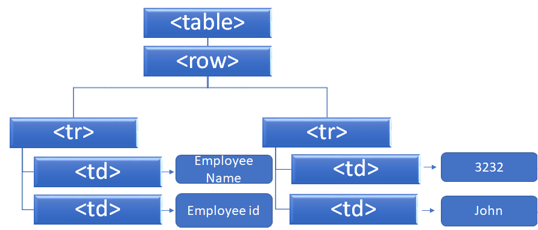

# Document Object Model
This is a practical introduction to the fundamentals of the DOM. DOM is defined as the logical structure of documents and the way a document is accessed and manipulated. The term "document" is being used as a way of representing many different kinds of information that may be stored in diverse systems, and much of this would traditionally be seen as data rather than as documents in XML.  With the Document Object Model, allows to create and build documents, navigate their structure, and add, modify, or delete elements and content.
### Example
```
      <table>
        <rows> 
          <tr> 
            <td>Employee id</td>
            <td>Employee name</td> 
          </tr> 
          <tr>
            <td>3232</td>
            <td>John</td> 
          </tr> 
        </rows>
      </table 
```
The DOM documents have a logical structure which is very much like a tree. The object model specifies the logical model for the programming interface, and this logical model may be implemented in any way that a particular implementation finds convenient


Each time you make a change in the code, DOM will be completely updated and rewritten. 
